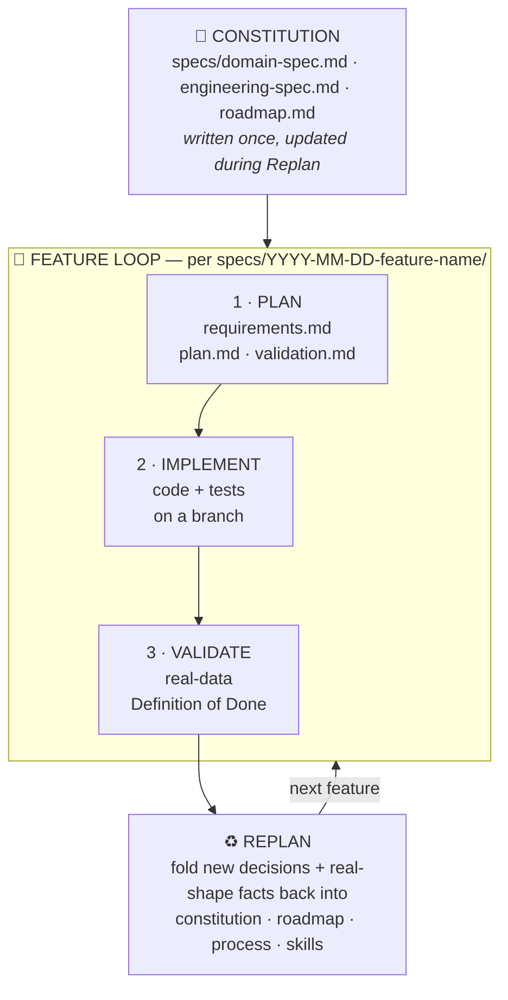
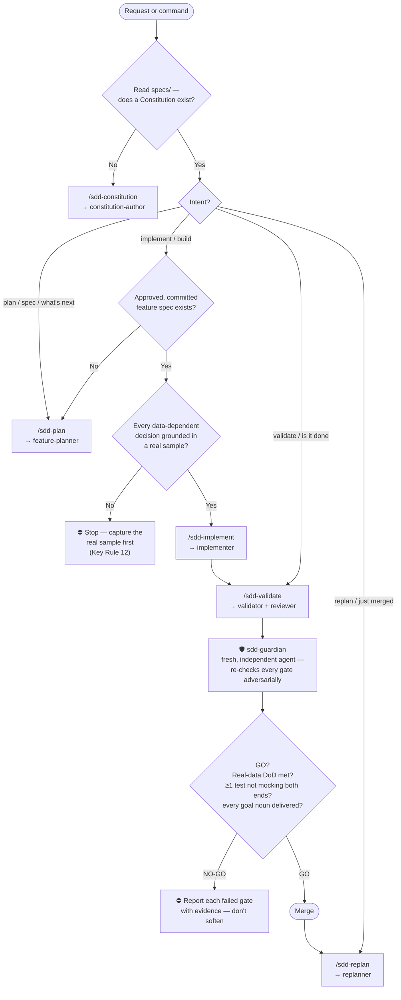
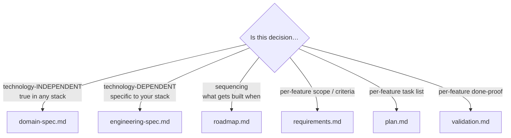

# sdd-kit

**A repo-agnostic, agent-agnostic Spec-Driven Development harness for Claude Code.**

Write structured markdown **specs before the agent writes a line of code**. The
spec is the brain; the agent is the muscle. Your job shifts from typing code to
writing clear specifications and reviewing output as an architect. A *grounded*
spec beats a *plausible* one — every decision that depends on the real shape of
something external (a file format, an API response, a log line, the live DB) is
verified against the real artifact **before** it's written down. The code tells
you what it *intends*; only the data tells you what is *true*.

> Structure mimics [cc10x](https://github.com/romiluz13/cc10x): a **router** skill
> is the brain, **agents** are phase specialists, **commands** are the lifecycle,
> **templates** are the six spec files, **skills** carry the durable rules.
> Methodology is the [Spec-Driven Development v4 playbook](reference/sdd-playbook-v4.md).

---

## The SDD cycle



The Constitution is written once at the start and updated during Replan. Each
feature gets its own spec (**Plan → Implement → Validate**). Between every
feature, you **Replan** before starting the next.

---

## How the router decides

Describe what you want, or run a command. The **`sdd-router`** skill orients on
your `specs/` directory, then routes — and **fails closed** on any gate.



**The fail-closed gates** (the whole point):

| Gate | Rule | Refuses when |
|---|---|---|
| No spec → no code | KR 1 | asked to implement without a reviewed, committed feature spec |
| Grounding | KR 12 | a data-dependent decision isn't backed by a cited real sample |
| Real-data done | KR 13 | "done" is claimed on tests that mock both ends |
| Noun-by-noun | KR 11 | a noun in the phase goal was silently dropped |

---

## Where does a decision go?



`"confidence ≥ 0.6 → confirmed"` is a **business rule** → domain-spec. The ORM
query that implements it is **technology-dependent** → engineering-spec. Full
table: [reference/where-does-it-go.md](reference/where-does-it-go.md).

---

## Commands

| You want to… | Run | Agent | Produces |
|---|---|---|---|
| Start/refresh the project agreement | `/sdd-constitution` | `constitution-author` | `specs/domain-spec.md`, `engineering-spec.md`, `roadmap.md` |
| Spec the next roadmap feature | `/sdd-plan` | `feature-planner` | `specs/<date>-<feature>/{requirements,plan,validation}.md` |
| Build an approved feature | `/sdd-implement` | `implementer` | code + tests on a branch (no merge) |
| Prove it's done | `/sdd-validate` | `validator` + `reviewer` | real-data Definition-of-Done verdict |
| Close the loop before the next feature | `/sdd-replan` | `replanner` | updated constitution/roadmap/skills |

When installed as a plugin, commands are namespaced: `/sdd-kit:sdd-plan`, etc.

---

## The agent team (best model per task)

The machine-readable flow, gates, models, and skill bindings live in
[config/workflow.json](config/workflow.json) — the router and guardian read it.

| Agent | Phase | Model | Why this model | Skills it carries |
|---|---|---|---|---|
| `constitution-author` | Constitution | **opus** | synthesizes the whole project agreement — highest leverage | key-rules, observability-invariants |
| `feature-planner` | Plan | **opus** | grounding + interview + spec design need judgment | grounding-discipline, key-rules, observability-invariants |
| `plan-gap-reviewer` | Plan (exit) | **opus** | fresh-eyes review of the spec *before* code — anti-anchoring, no sight of the planner's rationale | grounding-discipline, key-rules, observability-invariants |
| `implementer` | Implement | **sonnet** | executes an already-reviewed, grounded plan — speed in the loop | grounding-discipline, observability-invariants |
| `reviewer` | Validate | **opus** | independent architect-level drift/grounding review | key-rules, grounding-discipline |
| `validator` | Validate | **opus** | rigor; forces every failure/unknown path | key-rules, observability-invariants |
| `sdd-guardian` | Final gate | **opus** | adversarial GO/NO-GO — a **separate** agent from the validator, never self-review | key-rules, grounding-discipline, observability-invariants |
| `replanner` | Replan | **opus** | folds learnings back into the constitution — compounds across features | key-rules |

Every judgment/correctness role runs on opus; only the implementer runs on
sonnet. The **guardian is deliberately a different agent** from the validator so
the final sign-off is independent, not the checker grading its own work.

---

## The 14 Key Rules (the non-negotiables)

Full annotated list: [skills/sdd-key-rules](skills/sdd-key-rules/SKILL.md).

1. Write the spec before touching code. **2.** All changes through the agent, never
hand-edits (manual edits cause drift). **3.** Fresh context per feature. **4.**
Commit the spec before implementation. **5.** Small steps, frequent commits. **6.**
Replan between every feature. **7.** Surface open questions explicitly. **8.**
validation.md mirrors plan.md. **9.** The spec is living. **10.** Omissions aren't
failures. **11.** Audit the goal **noun-by-noun** before claiming done. **12.**
**Ground data-dependent decisions in real samples.** **13.** **Prove "done" on real
data, not mocks.** **14.** Interview with a recommendation, never a neutral menu.

Rules **12** and **13** were promoted to hard rules in v4 after a real build
repeatedly shipped confidently-wrong code (decisions written from a *plausible*
model of an external system, and "done" claimed on green tests that mocked both
ends). They are the cheapest insurance against the most expensive class of bug.

---

## What's in the box

```
sdd-kit/
├── .claude-plugin/
│   └── plugin.json                 # plugin manifest (identity)
├── config/
│   └── workflow.json               # machine-readable flow: phases, agents, models, GATES
├── agents/                         # phase specialists
│   ├── constitution-author.md      #   writes the 3 Constitution files
│   ├── feature-planner.md          #   writes the 3 feature-spec files
│   ├── plan-gap-reviewer.md        #   fresh-eyes review of the spec BEFORE code
│   ├── implementer.md              #   executes plan.md, no merge
│   ├── validator.md                #   runs validation.md, forces failure paths
│   ├── reviewer.md                 #   architect-level drift/grounding review
│   ├── sdd-guardian.md             #   final adversarial GO/NO-GO gate (independent)
│   └── replanner.md                #   folds learnings back into the constitution
├── commands/                       # the lifecycle: /sdd-constitution … /sdd-replan
│   └── sdd-{constitution,plan,implement,validate,replan}.md
├── hooks/                          # deterministic gate enforcement
│   ├── hooks.json                  #   SessionStart context + PreToolUse spec-before-code guard
│   └── README.md
├── scripts/                        # hook implementations (Python stdlib, no deps)
│   ├── inject_constitution.py
│   └── spec_before_code_guard.py
├── skills/                         # durable rules + the brain
│   ├── sdd-router/                 #   THE entry point — routes intent, fails closed
│   ├── sdd-key-rules/              #   the 14 invariants
│   ├── sdd-grounding-discipline/   #   Key Rule 12 — real samples before decisions
│   └── sdd-observability-invariants/ # the seam + "unknown is never success"
├── templates/                      # copy these, never start blank
│   └── {domain-spec,engineering-spec,roadmap,requirements,plan,validation}.template.md
└── reference/
    ├── sdd-playbook-v4.md           # the canonical methodology (source of truth)
    └── where-does-it-go.md          # content → file routing table
```

---

## Install

### Quickest — one line

In a terminal:

```bash
claude plugin marketplace add blutrich/sdd-kit && claude plugin install sdd-kit@sdd-kit
```

Or, already inside Claude Code, paste these two:

```text
/plugin marketplace add blutrich/sdd-kit
/plugin install sdd-kit@sdd-kit
```

That's the whole install — commands then appear as `/sdd-kit:sdd-plan` and
friends, skills auto-trigger via their descriptions, agents are available to the
`Task` tool, and the hooks load. (Claude Code has no single combined command or
URL-based one-click for plugins; the chained shell line above is the
lowest-friction path.)

---

This is a standard Claude Code plugin. Two other ways if the above doesn't fit:

**1. Vendor it (auto-loads for everyone who clones the repo).** Copy this folder
into your project as **`.claude/skills/sdd-kit/`** (it must contain
`.claude-plugin/plugin.json`). Claude Code then auto-loads it as a project-scoped
*skills-directory plugin* — `sdd-kit@skills-dir` — on the next session, after you
trust the workspace. No install step, no marketplace. Commands namespace as
`/sdd-kit:sdd-plan`; the hooks load too.

> ⚠️ A top-level `.agent/` directory is **not** auto-discovered by Claude Code —
> it would sit inert. Use `.claude/skills/<name>/` (project scope, auto-loaded)
> or `~/.claude/skills/<name>/` (personal scope, loads in every project).

The *live* specs you generate live in your project's `specs/` directory — nothing
here is tied to a specific repo, stack, or company.

**2. Marketplace install (reusable across all your projects).** The one-line
install at the top of this section is exactly this path — add the repo as a
marketplace, then install the plugin from it:

```text
/plugin marketplace add blutrich/sdd-kit
/plugin install sdd-kit@sdd-kit
```

The `@sdd-kit` suffix is the marketplace name (from `.claude-plugin/marketplace.json`),
which happens to match the plugin name here.

### Enforcement (fail-closed by default)

Once a project has a Constitution, the `spec-before-code` hook **blocks** edits to
implementation code on a branch with no feature spec (Key Rule 1). That's the
point — the kit enforces, it doesn't just advise. Downgrade per shell if you need
to: `export SDD_GUARD=warn` (advisory) or `SDD_GUARD=off` (silent). It never
touches `specs/`, docs, config, tests, or a project that has no Constitution yet.

---

## Why it works

- **Small spec changes produce large code changes.** One sentence can move
  hundreds of lines — specs are higher-leverage than code.
- **Specs solve context decay.** Agents are stateless; specs persist across
  sessions, agents, and teammates.
- **Specs improve intent fidelity.** Every decision you don't write down, the
  agent makes on its own — and usually wrong.
- **Agent-agnostic.** Specs are plain markdown; skills follow open standards. Switch
  agents and your constitution + skills come with you.

---

## Credits

Methodology: Spec-Driven Development v4. Harness shape inspired by
[cc10x](https://github.com/romiluz13/cc10x) (Rom Iluz). Assembled for Ofer
Blutrich & Tsahi (Isaac Zeevi).
