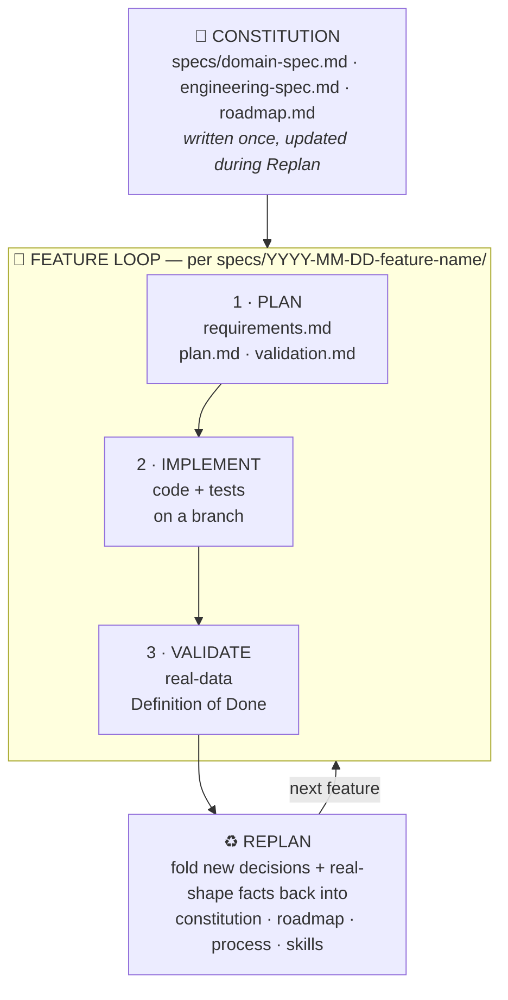
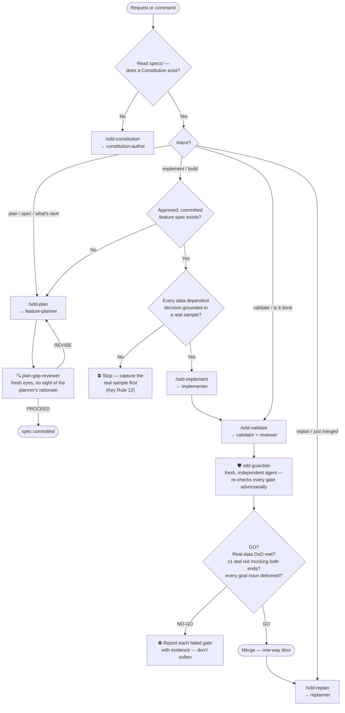
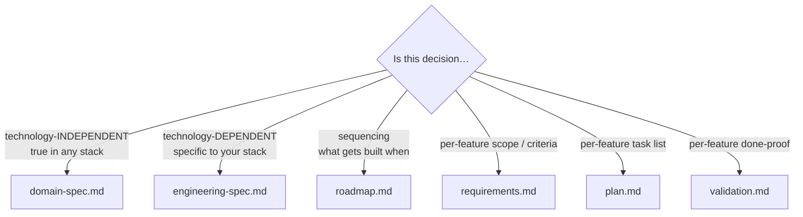

# sdd-kit

**A repo-agnostic, harness-agnostic Spec-Driven Development harness — runs under Claude Code and OpenAI Codex.**

Write structured markdown **specs before the agent writes a line of code**. The
spec is the brain; the agent is the muscle. Your job shifts from typing code to
writing clear specifications and reviewing output as an architect. A *grounded*
spec beats a *plausible* one — every decision that depends on the real shape of
something external (a file format, an API response, a log line, the live DB) is
verified against the real artifact **before** it's written down. The code tells
you what it *intends*; only the data tells you what is *true*.

And when a gate isn't met, the kit doesn't advise — **it refuses**.

> **Landing page:** https://sdd-kit-landing-7ffdd269.base44.app
> **Repo:** https://github.com/blutrich/sdd-kit · MIT · current version **0.5.0**
>
> Structure mimics [cc10x](https://github.com/romiluz13/cc10x): a **router** skill
> is the brain, **agents** are phase specialists, **commands** are the lifecycle,
> **templates** are the six spec files, **skills** carry the durable rules.
> Methodology is the [Spec-Driven Development playbook](reference/sdd-playbook-v4.md).

---

## Contents

- [Install (30 seconds)](#install-30-seconds)
- [Harness support: Claude Code & Codex](#harness-support-claude-code--codex)
- [Your first cycle (10 minutes)](#your-first-cycle-10-minutes)
- [The SDD cycle](#the-sdd-cycle)
- [How the router decides](#how-the-router-decides)
- [Autonomous mode — stop only at one-way doors](#autonomous-mode--stop-only-at-one-way-doors)
- [The gates](#the-gates)
- [Where does a decision go?](#where-does-a-decision-go)
- [Commands](#commands)
- [The agent team](#the-agent-team-best-model-per-task)
- [The 16 Key Rules](#the-16-key-rules-the-non-negotiables)
- [Hooks: deterministic enforcement](#hooks-deterministic-enforcement)
- [What a live project looks like](#what-a-live-project-looks-like)
- [What's in the box](#whats-in-the-box)
- [Configuration](#configuration)
- [Troubleshooting & gotchas](#troubleshooting--gotchas)
- [Field results](#field-results)
- [Why it works](#why-it-works)

---

## Install (30 seconds)

### Claude Code

In a terminal:

```bash
claude plugin marketplace add blutrich/sdd-kit && claude plugin install sdd-kit@sdd-kit
```

Or, already inside Claude Code, paste these two:

```text
/plugin marketplace add blutrich/sdd-kit
/plugin install sdd-kit@sdd-kit
```

That's the whole install — commands appear as `/sdd-kit:sdd-plan` and friends,
skills auto-trigger via their descriptions, agents are available to the `Task`
tool, and the hooks load. (The `@sdd-kit` suffix is the marketplace name from
`.claude-plugin/marketplace.json`, which happens to match the plugin name.)

**Alternative — vendor it** (auto-loads for everyone who clones your repo):
copy this folder into your project as **`.claude/skills/sdd-kit/`** (it must
contain `.claude-plugin/plugin.json`). Claude Code auto-loads it as a
project-scoped *skills-directory plugin* — `sdd-kit@skills-dir` — on the next
session, after you trust the workspace. No install step, hooks included.

> ⚠️ A top-level `.agent/` directory is **not** auto-discovered by Claude Code —
> it would sit inert. Use `.claude/skills/<name>/` (project scope) or
> `~/.claude/skills/<name>/` (personal scope, loads in every project).

### Codex (OpenAI)

Clone once, then let the installer lay the kit out the way Codex discovers it:

```bash
git clone https://github.com/blutrich/sdd-kit ~/sdd-kit
cd your-project
python3 ~/sdd-kit/scripts/sdd_install.py --harness codex        # project scope (commit the result)
# or:  --scope user   → ~/.agents/skills + ~/.codex/hooks.json for every project
```

That writes `.agents/skills/sdd-*/` (the router + rules skills, plus one skill
per lifecycle command so `$sdd-plan` is `/sdd-plan`), `.agents/skills/sdd-kit/`
(the kit root: playbook, templates, agent roles, scripts), `.codex/hooks.json`
(the same three hook scripts — Codex fires `PreToolUse` on `apply_patch` and
`Bash` with the same JSON contract), and an idempotent block in `AGENTS.md`.
Restart Codex and trust the repo; then `$sdd-router` / `$sdd-constitution`.

`--harness both` (the default) lays out both harnesses side by side, so one
repo can be worked by teammates on either tool. `--link` symlinks instead of
copying for kit development.

**Note:** the kit is deliberately **inert** until a Constitution exists. If you
install it and nothing changes, that's correct — run `/sdd-kit:sdd-constitution`
to switch it on. The hooks require `python3` on PATH (macOS/Linux).

---

## Harness support: Claude Code & Codex

The kit is one set of plain-markdown files plus three stdlib Python hook
scripts. Nothing in the method is tool-specific; only the *discovery layout*
differs, and `scripts/sdd_install.py` writes it for you.

| | Claude Code | Codex |
|---|---|---|
| Install | `/plugin install sdd-kit@sdd-kit`, or vendor at `.claude/skills/sdd-kit/` | `sdd_install.py --harness codex` → `.agents/skills/` |
| Entry point | `sdd-router` skill auto-triggers; `/sdd-kit:sdd-plan` … | `$sdd-router`; `$sdd-plan` … (commands become skills) |
| Agents | `agents/*.md` spawn as subagents via `Task` | roles adopted in a fresh pass, or spawned if the harness supports subagents |
| Hooks | `hooks/hooks.json`, auto-loaded | `.codex/hooks.json`, same schema and same scripts |
| Edit gate fires on | `Edit` / `Write` / `MultiEdit` | `apply_patch` (paths read from the patch headers) |
| Session context | `SessionStart` hook | `SessionStart` hook + `AGENTS.md` block |
| Kit root | `$CLAUDE_PLUGIN_ROOT` | `.agents/skills/sdd-kit/` (`$PLUGIN_ROOT` when packaged) |
| Health check | `/sdd-doctor` | `$sdd-doctor` — detects the harness, checks its layout |

Env knobs (`SDD_GUARD`, `SDD_SPECS_DIR`, `SDD_KIT_ROOT`, `SDD_HARNESS`,
`SDD_HOOK_FORMAT`) are identical on both. Your specs, constitution, and samples
are plain markdown either way — switch tools mid-project and nothing moves.

---

## Your first cycle (10 minutes)

```text
# 1 · Write the project agreement (once per project).
#     A grounded interview → three files in specs/. Greenfield = interview;
#     brownfield = reverse-engineered from the code, then verified on runtime data.
/sdd-kit:sdd-constitution

# 2 · Spec the first roadmap feature — before any code.
#     Produces specs/YYYY-MM-DD-<feature>/{requirements,plan,validation}.md
#     + real captured samples under samples/. A fresh-eyes plan-gap-reviewer
#     (who never sees the planner's reasoning) must say PROCEED.
/sdd-kit:sdd-plan

# 3 · Build it, task group by task group, with tests, on a branch
#     named exactly like the spec dir (YYYY-MM-DD-<feature> — see gotchas!).
/sdd-kit:sdd-implement

# 4 · Prove it — validation.md runs as an executable checklist, including one
#     end-to-end pass on REAL data. Then the guardian (a separate adversarial
#     agent) re-checks every gate and returns GO or NO-GO with evidence.
/sdd-kit:sdd-validate

# 5 · Merge (the one human decision), then fold the learnings back.
/sdd-kit:sdd-replan
```

Or skip the commands entirely: describe what you want ("plan the next
feature", "is this done?") and the **`sdd-router`** skill orients on your
`specs/` directory and routes — failing closed on any gate.

---

## The SDD cycle


```mermaid
flowchart TD
    C["📜 CONSTITUTION<br/>specs/domain-spec.md · engineering-spec.md · roadmap.md<br/><i>written once, updated during Replan</i>"]
    C --> L

    subgraph L["🔁 FEATURE LOOP — per specs/YYYY-MM-DD-feature-name/"]
        direction LR
        P["1 · PLAN<br/>requirements.md<br/>plan.md · validation.md"]
        I["2 · IMPLEMENT<br/>code + tests<br/>on a branch"]
        V["3 · VALIDATE<br/>real-data<br/>Definition of Done"]
        P --> I --> V
    end

    V --> R["♻️ REPLAN<br/>fold new decisions + real-shape facts back into<br/>constitution · roadmap · process · skills"]
    R -->|next feature| L
```

The Constitution is written once at the start and updated during Replan. Each
feature gets its own spec (**Plan → Implement → Validate**). Between every
feature, you **Replan** before starting the next — that's how the system
compounds instead of drifting.

---

## How the router decides


```mermaid
flowchart TD
    START([Request or command]) --> ORIENT{"Read specs/ —<br/>does a Constitution exist?"}
    ORIENT -->|No| CONST["/sdd-constitution<br/>→ constitution-author"]
    ORIENT -->|Yes| INTENT{Intent?}

    INTENT -->|"plan / spec / what's next"| PLAN["/sdd-plan<br/>→ feature-planner"]
    INTENT -->|"implement / build"| GATE1{"Approved, committed<br/>feature spec exists?"}
    INTENT -->|"validate / is it done"| VAL["/sdd-validate<br/>→ validator + reviewer"]
    INTENT -->|"replan / just merged"| REPLAN["/sdd-replan<br/>→ replanner"]

    PLAN --> PGR["🔍 plan-gap-reviewer<br/>fresh eyes, no sight of the<br/>planner's rationale"]
    PGR -->|REVISE| PLAN
    PGR -->|PROCEED| READY([spec committed])

    GATE1 -->|No| PLAN
    GATE1 -->|Yes| GATE2{"Every data-dependent<br/>decision grounded in<br/>a real sample?"}
    GATE2 -->|No| GROUND["⛔ Stop — capture the<br/>real sample first<br/>(Key Rule 12)"]
    GATE2 -->|Yes| IMPL["/sdd-implement<br/>→ implementer"]

    IMPL --> VAL
    VAL --> GUARD["🛡️ sdd-guardian<br/>fresh, independent agent —<br/>re-checks every gate adversarially"]
    GUARD --> DONE{"GO?<br/>Real-data DoD met?<br/>≥1 test not mocking both ends?<br/>every goal noun delivered?"}
    DONE -->|"NO-GO"| FIX["⛔ Report each failed gate<br/>with evidence — don't soften"]
    DONE -->|"GO"| MERGE([Merge — one-way door]) --> REPLAN
```

Routing priority on ambiguous input: **ERROR / grounding-doubt always wins**,
then validate > implement > plan > replan. If there's an in-flight feature,
continue it — don't start a new one.

---

## Autonomous mode — stop only at one-way doors

Since v0.3.0 the router runs the cycle **autonomously by default**
(`config/workflow.json` → `automation.mode: "autonomous"`). It chains
plan → implement → validate → guardian on its own, evaluates each phase's exit
gates itself, and **auto-remediates** mechanical failures (capture the missing
sample, route a REVISE back to the planner, commit the spec, force the
failure/unknown path) rather than bouncing them to you.

It stops and asks **only at a one-way door**:

- **Merge / release / deploy** to a shared or production target
- **Destructive or irreversible action** — delete/drop data, force-push, prod migration
- **External side effect with real-world reach** — send a message, post publicly, charge money
- **Dropping a goal noun** — deferring anything the phase goal named requires your sign-off (KR 11)
- A genuinely ambiguous fork with expensive-to-reverse consequences and no defensible default
- A gate still **NO-GO after remediation was attempted**

Everything reversible — edits, new code, tests, spec files, feature-branch
commits — is a two-way door: the agent just does it. And **every build cycle
ends with an operator summary**: the phase goal, each goal noun
delivered/deferred, every gate's PASS/NO-GO with one line of evidence, what
changed, what was auto-remediated, and what's next — *then* the merge question.
You read the summary, you make the irreversible call.

The gates are never skipped in autonomous mode. What changes is only *who
clears a passing gate*: the agent does, instead of a human round-trip.

---

## The gates

The headline four (the ones you'll hit daily):

| Gate | Rule | Refuses when |
|---|---|---|
| No spec → no code | KR 1 | asked to implement without a reviewed, committed feature spec |
| Grounding | KR 12 | a data-dependent decision isn't backed by a cited real sample |
| Real-data done | KR 13 | "done" is claimed on tests that mock both ends |
| Noun-by-noun | KR 11 | a noun in the phase goal was silently dropped |

The full registry lives in [config/workflow.json](config/workflow.json) — nine
gates wired between phases; the router and the guardian read it:

| Gate | Asserts |
|---|---|
| `constitution_complete` | domain-spec has Core Workflow + Observable Lifecycle + "Unknown is never recorded as success"; engineering-spec has the observability seam + external-dependency failure modes; every roadmap phase has a goal **and** a "What this gives…" line |
| `spec_grounded` | every data-dependent decision cites a **real captured sample committed under `specs/<feature>/samples/`** with a provenance line (the capture command) — not a block pasted from memory |
| `plan_reviewed` | the spec passed the independent fresh-eyes plan-gap-reviewer with a PROCEED verdict, **before** code |
| `spec_committed` | the three feature-spec files are committed before implementation begins |
| `spec_before_code` | a reviewed, committed feature spec exists before any implementation |
| `real_data_done` | ≥ 1 test exercises real collaborators **and** the feature was proven once end-to-end against the real running system, artifact inspected and captured |
| `failure_unknown_verified` | every signal's failure/unknown path was forced and confirmed to record *unknown/failed* — never collapsed into ok/empty/done |
| `noun_by_noun` | every noun in the phase goal is delivered, or explicitly deferred with sign-off and a written reason |
| `all_gates_pass` | the guardian's conjunction — a single failed gate is NO-GO |

The guardian's verdict is a fixed format — each gate ✅/❌ **with evidence**
(commit hashes, file:line ↔ sample citations, the captured artifact), then
`VERDICT: GO` or `NO-GO` with the shortest path to GO per failed gate.
*"A single ❌ is NO-GO. Do not soften, do not average, do not pass on 'close
enough.'"*

---

## Where does a decision go?


```mermaid
flowchart TD
    Q{"Is this decision…"}
    Q -->|technology-INDEPENDENT<br/>true in any stack| D["domain-spec.md"]
    Q -->|technology-DEPENDENT<br/>specific to your stack| E["engineering-spec.md"]
    Q -->|sequencing<br/>what gets built when| RM["roadmap.md"]
    Q -->|per-feature scope / criteria| RQ["requirements.md"]
    Q -->|per-feature task list| PL["plan.md"]
    Q -->|per-feature done-proof| VL["validation.md"]
```

`"confidence ≥ 0.6 → confirmed"` is a **business rule** → domain-spec. The ORM
query that implements it is **technology-dependent** → engineering-spec. Full
table: [reference/where-does-it-go.md](reference/where-does-it-go.md).

---

## Commands

| You want to… | Run | Agent | Produces |
|---|---|---|---|
| Start/refresh the project agreement | `/sdd-constitution` `[greenfield\|brownfield]` | `constitution-author` | `specs/domain-spec.md`, `engineering-spec.md`, `roadmap.md` |
| Spec the next roadmap feature | `/sdd-plan` `[feature or phase]` | `feature-planner` → `plan-gap-reviewer` | `specs/<date>-<feature>/{requirements,plan,validation}.md` + `samples/` |
| Build an approved feature | `/sdd-implement` `[feature dir]` | `implementer` | code + tests on a branch (no merge) |
| Prove it's done | `/sdd-validate` `[feature dir]` | `validator` + `reviewer` → `sdd-guardian` | real-data DoD verdict, then GO / NO-GO |
| Close the loop before the next feature | `/sdd-replan` `[merged feature dir]` | `replanner` | updated constitution/roadmap/skills |
| Check the kit is installed & enforcing | `/sdd-doctor` | — (script) | health report: interpreter, hooks, cache freshness, branch↔spec |

When installed as a plugin, commands are namespaced: `/sdd-kit:sdd-plan`, etc.

---

## The agent team (best model per task)

The machine-readable flow, gates, models, and skill bindings live in
[config/workflow.json](config/workflow.json).

| Agent | Phase | Model | Why this model | Can write? |
|---|---|---|---|---|
| `constitution-author` | Constitution | **opus** | synthesizes the whole project agreement — highest leverage | ✏️ yes |
| `feature-planner` | Plan | **opus** | grounding + interview + spec design need judgment | ✏️ yes |
| `plan-gap-reviewer` | Plan (exit) | **opus** | fresh-eyes review of the spec *before* code — anti-anchoring, no sight of the planner's rationale | 🔒 read-only |
| `implementer` | Implement | **sonnet** | executes an already-reviewed, grounded plan — speed in the loop | ✏️ yes |
| `reviewer` | Validate | **opus** | independent architect-level drift/grounding review | 🔒 read-only |
| `validator` | Validate | **opus** | rigor; forces every failure/unknown path — "run, don't eyeball" | 🔒 read-only |
| `sdd-guardian` | Final gate | **opus** | adversarial GO/NO-GO — a **separate** agent from the validator, never self-review | 🔒 read-only |
| `replanner` | Replan | **opus** | folds learnings back into the constitution — compounds across features | ✏️ yes |

Two structural safeguards worth noticing:

1. **Reviewers physically cannot fix what they find** — the four checking
   agents carry no Write/Edit tools. A reviewer that can patch the thing it's
   judging stops being a reviewer.
2. **The final sign-off is independent** — `plan-gap-reviewer` and
   `sdd-guardian` are the same idea at opposite ends of the cycle: a fresh
   agent with no sight of the author's reasoning, one before code, one before
   merge.

---

## The 16 Key Rules (the non-negotiables)

Full annotated list: [skills/sdd-key-rules](skills/sdd-key-rules/SKILL.md).

1. Write the spec before touching code. **2.** All changes through the agent, never
hand-edits (manual edits cause drift). **3.** Fresh context per feature. **4.**
Commit the spec before implementation. **5.** Small steps, frequent commits. **6.**
Replan between every feature. **7.** Surface open questions explicitly. **8.**
validation.md mirrors plan.md. **9.** The spec is living. **10.** Omissions aren't
failures. **11.** Audit the goal **noun-by-noun** before claiming done. **12.**
**Ground data-dependent decisions in real samples.** **13.** **Prove "done" on real
data, not mocks.** **14.** Interview with a recommendation, never a neutral menu.
**15.** **Declare service contracts before coding** — every requirements.md lists
*Services I depend on* and *Services I modify*, cross-referenced across specs.
**16.** **Verify caller wiring on every signature change** — grep all callers,
audit them in the PR; a green compile verifies types, not runtime wiring.

Rules **12** and **13** were promoted to hard rules in v4 after a real build
repeatedly shipped confidently-wrong code (decisions written from a *plausible*
model of an external system, and "done" claimed on green tests that mocked both
ends). Rules **15** and **16** were added in v5 after the complementary failure
mode: a unit-green change that silently broke the wire contract between
components. They are the cheapest insurance against the most expensive classes
of bug.

---

## Hooks: deterministic enforcement

Prose rules depend on the model complying. Two Python hooks (stdlib only, no
dependencies) enforce the core invariant **outside** agent goodwill — they load
automatically with the plugin ([hooks/hooks.json](hooks/hooks.json)):

### `SessionStart` → `inject_constitution.py`

If the project has `specs/domain-spec.md`, every session starts with the
Constitution pointer injected into context: which of the three files exist, the
**next unchecked roadmap phase**, and a reminder of KR 12/13. Silent no-op in
non-SDD projects. This is how a fresh session always knows where the project
agreement lives and what's next — no re-explaining.

### `PreToolUse` (Edit|Write|MultiEdit, Codex `apply_patch`) → `spec_before_code_guard.py`

Once a project has a Constitution, editing **implementation code** on a branch
with no **committed** feature spec is **denied** (Key Rules 1 + 4) — the kit
enforces, it doesn't just advise. Exact behavior:

- Only fires on code files (`.ts .tsx .js .jsx .py .go .rs .java .rb .php .c
  .cpp .cs .swift .kt .sh .bash .zsh .sql .vue .svelte .ex .exs .dart .scala
  .tf .lua .pl .zig .m .mm`). Never touches `specs/`, `docs/`, `.claude/`,
  `.github/`, markdown/JSON/YAML/TOML/lock files, `package.json`,
  `tsconfig.json`, `README.md`, or test files (`tests/`, `__tests__/`, `e2e/`
  directories; `test_*`, `*_test.*`, `*.test.*`, `*.spec.*`, `conftest.py`).
- Resolves the branch to a spec dir by: exact name → last path segment (so
  `spec/2026-08-11-thing` finds `specs/2026-08-11-thing/`) → slashes slugified
  to dashes. The matched `requirements.md` must be **committed to git** — an
  untracked spec does not open the gate.
- On `main`/`master` or a detached HEAD it explains the branch contract
  instead of failing cryptically.
- Inert in any project without `specs/domain-spec.md`.
- Fails **open** on any internal error — a guard that breaks the editor is
  worse than no guard.

### `PreToolUse` (Bash) → `bash_write_guard.py`

Shell writes to code files (heredocs, `>`/`>>`, `tee`, `sed -i`) on a branch
with no committed spec get a ⚠️ advisory injected into context. Deliberately
**advisory-only** — shell parsing is heuristic and must never
false-positive-block — but it closes the quiet-workaround hole: a bypass that
announces itself stops being a bypass.

### `/sdd-doctor` — verify it's all actually on

The hooks fail open, so a missing `python3` or a **stale plugin cache**
produces a kit that looks installed and enforces nothing. `/sdd-doctor` checks
interpreter, script health, cache freshness vs the kit version, Constitution
presence, `SDD_GUARD` mode, and whether your current branch resolves to a
spec — one ❌ line per problem, with the fix. The hook scripts also ship a real
test suite: `python3 -m unittest discover -s tests`.

Modes, via the `SDD_GUARD` env var (set in the shell that launches your agent,
or in `.claude/settings.json` → `env` for Claude Code):

| `SDD_GUARD` | Behavior |
|---|---|
| `block` *(default)* | deny the edit, explain why, name the escape hatches |
| `warn` / `advisory` | allow, but inject a ⚠️ advisory into context |
| `off` / `0` / `false` | silent no-op |

---

## What a live project looks like

```
your-project/
├── specs/
│   ├── domain-spec.md               # tech-independent truths (business rules, workflow, lifecycle)
│   ├── engineering-spec.md          # your stack: architecture, observability seam, failure modes
│   ├── roadmap.md                   # phases with goals + "what this gives users" + status
│   └── 2026-08-11-billing-layer/    # one feature = one dated dir = one branch name
│       ├── requirements.md          #   scope, deliverables (KR11), service contracts (KR15/16),
│       │                            #   grounding citations, failure modes, success criteria
│       ├── plan.md                  #   numbered task groups, tests always last
│       ├── validation.md            #   executable done-checklist incl. real-data E2E
│       └── samples/                 #   REAL captured artifacts, each with a provenance line:
│           └── stripe-invoice.json  #   "captured 2026-08-11 via: curl https://api.stripe.com/…"
└── src/ …                           # written only after all of the above
```

Everything above `src/` is plain markdown — no lock-in to a repo, stack,
company, or even to Claude: switch agents and your constitution and specs come
with you.

---

## What's in the box

```
sdd-kit/
├── .claude-plugin/
│   ├── plugin.json                 # plugin manifest (identity, v0.5.0)
│   └── marketplace.json            # marketplace manifest (install as sdd-kit@sdd-kit)
├── config/
│   └── workflow.json               # machine-readable flow: phases, agents, models, GATES, automation
├── agents/                         # phase specialists
│   ├── constitution-author.md      #   writes the 3 Constitution files
│   ├── feature-planner.md          #   writes the 3 feature-spec files + samples/
│   ├── plan-gap-reviewer.md        #   fresh-eyes review of the spec BEFORE code
│   ├── implementer.md              #   executes plan.md, no merge
│   ├── validator.md                #   runs validation.md, forces failure paths
│   ├── reviewer.md                 #   architect-level drift/grounding review
│   ├── sdd-guardian.md             #   final adversarial GO/NO-GO gate (independent)
│   └── replanner.md                #   folds learnings back into the constitution
├── commands/                       # the lifecycle: /sdd-constitution … /sdd-replan, /sdd-doctor
│   └── sdd-{constitution,plan,implement,validate,replan,doctor}.md
├── hooks/                          # deterministic gate enforcement
│   ├── hooks.json                  #   SessionStart context + PreToolUse guards (Edit/Write/apply_patch + Bash)
│   └── README.md
├── scripts/                        # hook implementations (Python stdlib, no deps)
│   ├── inject_constitution.py
│   ├── spec_before_code_guard.py
│   ├── bash_write_guard.py         #   advisory visibility for shell writes to code
│   ├── check_grounding.py          #   mechanical half of the spec_grounded gate (KR12)
│   ├── sdd_doctor.py               #   /sdd-doctor implementation (harness-aware)
│   ├── sdd_harness.py              #   the ONLY file that knows CLAUDE_*/PLUGIN_ROOT names
│   └── sdd_install.py              #   lays the kit out for Claude Code, Codex, or both
├── tests/
│   └── test_hooks.py               # real-git-repo tests for the hook scripts
├── skills/                         # durable rules + the brain
│   ├── sdd-router/                 #   THE entry point — routes intent, autonomous mode, fails closed
│   ├── sdd-key-rules/              #   the 16 invariants
│   ├── sdd-grounding-discipline/   #   Key Rule 12 — real samples before decisions
│   └── sdd-observability-invariants/ # the seam + "unknown is never success"
├── templates/                      # copy these, never start blank
│   └── {domain-spec,engineering-spec,roadmap,requirements,plan,validation}.template.md
├── reference/
│   ├── sdd-playbook-v4.md          # the canonical methodology
│   └── where-does-it-go.md         # content → file routing table
├── IMPROVEMENTS.md                 # evidence-grounded improvement backlog (from real usage)
└── LICENSE                         # MIT — © 2026 Ofer Blutrich & Tsahi (Isaac Zeevi)
```

---

## Configuration

| Knob | Where | Default | What it does |
|---|---|---|---|
| `SDD_GUARD` | env | `block` | spec-before-code hook mode: `block` / `warn` / `off` |
| `SDD_SPECS_DIR` | env | `specs` | move specs out of the top level, e.g. `docs/specs` — hooks, commands, and router all resolve it, so creation and enforcement stay in sync |
| `automation.mode` | `config/workflow.json` | `autonomous` | auto-chain the cycle; stop only at one-way doors. Change it for phase-by-phase approval |
| per-agent `model` | `agents/*.md` frontmatter | opus/sonnet | override per project — SDD is model-agnostic |
| `SDD_HARNESS` | env | auto-detect | force `claude` / `codex` / `generic` for the doctor and hooks |
| `SDD_KIT_ROOT` | env | auto | explicit kit location when neither harness variable is set |
| `SDD_HOOK_FORMAT` | env | `json` | `text` for a harness that only reads plain stdout from `SessionStart` |

Set env vars in the shell that launches your agent, or per-project in
`.claude/settings.json` under `"env"` (Claude Code).

---

## Troubleshooting & gotchas

**"The guard blocks everything on `main`."** By design: SDD implements on a
feature branch named after its spec dir, so `main` has no spec to resolve. The
guard now says exactly that when it fires on `main`. For a genuine hotfix:
`SDD_GUARD=warn`.

**Branch names map to spec dirs.** Preferred: flat branch names that equal the
spec dir (`2026-08-11-thing`). Slashed branches now also resolve — the guard
tries the exact name, then the last path segment (`spec/2026-08-11-thing` →
`specs/2026-08-11-thing/`), then the slug (`feat/x` → `specs/feat-x/`). The
matched `requirements.md` must be **committed** — an untracked spec doesn't
open the gate (KR 4).

**"I installed it and nothing happened."** Correct — the kit is inert until
`specs/domain-spec.md` exists. Run `/sdd-kit:sdd-constitution`. To confirm the
install is healthy either way: `/sdd-doctor`.

**"The hooks don't fire at all."** Run `/sdd-doctor` — it checks the usual
suspects in one pass: `python3` on PATH, broken scripts, and a **stale plugin
cache** (the most common cause under Claude Code; fix with `/plugin update sdd-kit`).
Under Codex it checks that `.agents/skills/sdd-router` exists and that a
`.codex/hooks.json` references the guard; remember project hooks load only in a
**trusted** repo and only after a restart. The hooks *fail open* by design, so
any of those looks like silent non-enforcement.

**"Tests are getting blocked."** They shouldn't be: files under `tests/`,
`__tests__/`, `e2e/` and basenames matching `test_*`, `*_test.*`, `*.test.*`,
`*.spec.*`, `conftest.py` are exempt. (And `latest.ts` is correctly treated as
code — the exemption is anchored, not a substring match.)

**Validation checklists rot.** Field observation across a dozen projects:
checklists get written, boxes don't get ticked. Treat `validation.md` as the
*spec* of done and record each run as a dated log (several projects keep a
`validation-runs.md`) — the guardian reads evidence, not checkbox state.

**Big project? Specs accumulate.** Long-lived repos have hit hundreds of
thousands of tokens of spec text. Archive ✅-done feature dirs (e.g.
`specs/archive/`) during replan and keep the constitution + roadmap lean —
the roadmap is the index, not the corpus.

---

## Field results

The kit's design decisions come from dogfooding across **12 real projects,
~140 feature specs, and 300+ committed grounding samples** (May–Aug 2026).
A few receipts:

- **Guardian NO-GOs caught real failure modes pre-merge**: a live-deploy
  overclaim with an impossible timestamp; a guard reachable only in tests, not
  under live input; a phone-guard bypassable by a text match and missing its
  negative assertion. All real; all fixed before merge.
- **The grounding gate caught a false RED** before it could mislead a customer
  renewal decision — the joined data *looked* plausible and was wrong.
- **Real-data validation refuted 2 of 5 claimed P0 security findings** — they
  weren't live; the claimed severity dissolved on contact with the real DB.
- **KR12 falsified four handed-down premises before any code** in a project
  restart — assumptions everyone "knew" that the real capture disproved.
- The forced **Failure/Unknown table** flagged that a loose assertion would
  have passed a wrong error state: *"the gate earned its keep."*

The recurring lesson, verbatim from a weekly review: **"SDD guardian NO-GO
gates are cheaper than prod bugs."**

Known weaknesses are tracked honestly in [IMPROVEMENTS.md](IMPROVEMENTS.md) —
including the branch-naming bug, a Bash-heredoc bypass of the guard, and
checkbox rot. The kit holds itself to its own rule: omissions aren't failures;
*hidden* omissions are.

---

## Why it works

- **Small spec changes produce large code changes.** One sentence can move
  hundreds of lines — specs are higher-leverage than code.
- **Specs solve context decay.** Agents are stateless; specs persist across
  sessions, agents, and teammates.
- **Specs improve intent fidelity.** Every decision you don't write down, the
  agent makes on its own — and usually wrong.
- **Fail-closed beats advisory.** Every gate in this kit exists because the
  advisory version of it was ignored at least once in a real build.
- **Agent-agnostic.** Specs are plain markdown; skills follow open standards.
  Switch agents and your constitution + skills come with you.

---

## Credits

Methodology: Spec-Driven Development v4/v5. Harness shape inspired by
[cc10x](https://github.com/romiluz13/cc10x) (Rom Iluz). Assembled for Ofer
Blutrich & Tsahi (Isaac Zeevi). MIT license.
